## 简介

此项目是利用cpu的0环特性，在3环实现反调试。 也就是在32位的pe中执行64位的代码。


## 32位 syscall原理

32位的syscall 最终还是通过调用 64位的ntdll的syscall进入内核的。 微软做了一个中间层wow64来负责吧32位转成64位。

下面时一个32位的exprecess 函数跟踪。

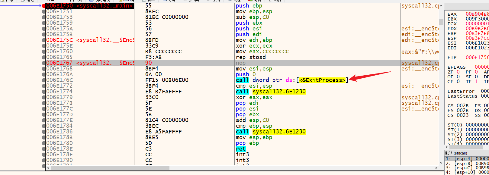

调到了32位ntdll里面的 NtTermimatePrecess函数

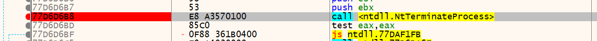

### 0x01调用门代码

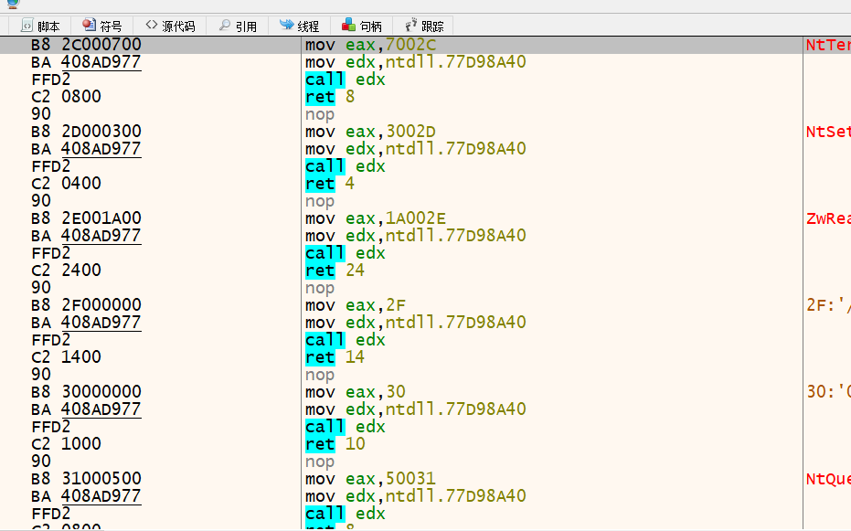

这边就跟到了 wow64转译层

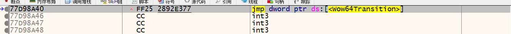

一直往下走

### 0x0264位的调用门

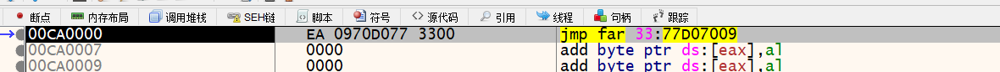

```
jmp far 33:77D07009  //将32位模式切换成64位模式   
77D07009             //吧这个当64位代码执行
```

## 理论有了下面开始实践。


### 0x01 切换CS

在调用函数之前 加上一个int3 断点， 双机调试运行的时候就会断到这个位置。

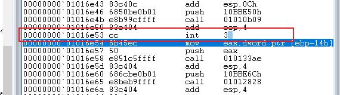

然后 走到 切cs寄存器的位置

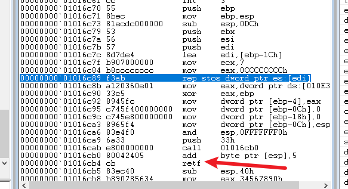

可以直接g到这个位置

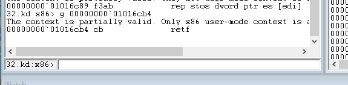

现在 cpu还是32位模式的，当执行retf的时候 cs寄存器会切到33， cpu会切换至64位模式 

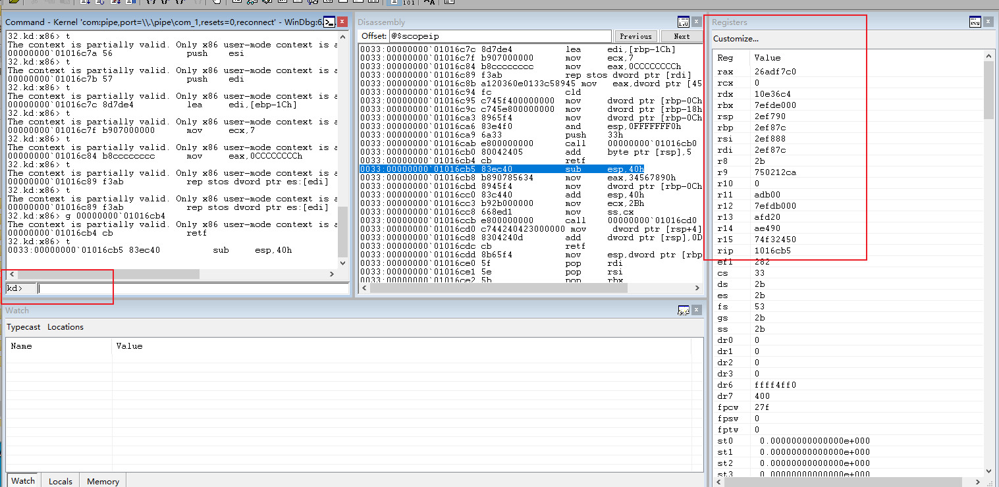

```
push    33h   			；33h 作为参数入栈
call next：  			就是吧下一条汇编的地址 压入esp栈顶。
add     byte ptr [rsp],5   ； 纠正返回地址到 retf的下一条汇编所在的地址。
retf					；从栈弹出cs寄存器的值，并且rsp栈顶的值给 rip   

retf 指令之后 cs的值是33h， rip所指向的汇编按照 64位解析
```


### 0x02执行64位汇编

然后单步往下走， 走到64位的命令

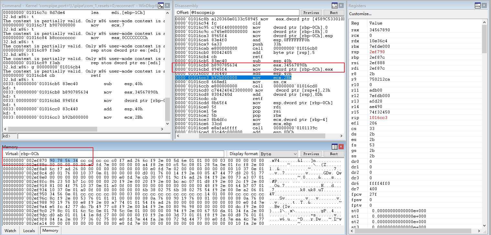

可以看到 64位的指令已经被正常执行 而且数据也写入到了局部变量里面


### 0x03 回到32位模式

下面这几句汇编就是让cpu从 64位模式回到32位模式。

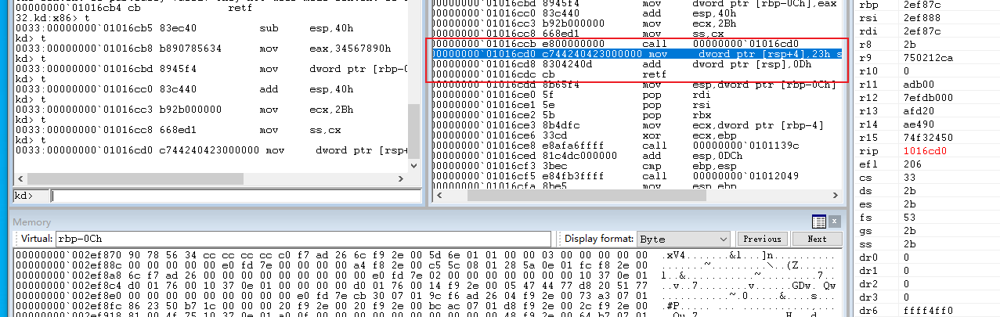

```
call next:  就是吧下一条汇编的地址 压入rsp栈顶。
mov     dword ptr [rsp+4],23h     ；23h作为参数入栈
add     dword ptr [rsp],0Dh      ； 纠正返回地址到 retf的下一条汇编所在的地址。 
retf     						；从栈弹出cs寄存器的值，并且rsp栈顶的值给 eip

retf 指令之后 cs的值是23h， eip所指向的汇编按照 32位解析
```

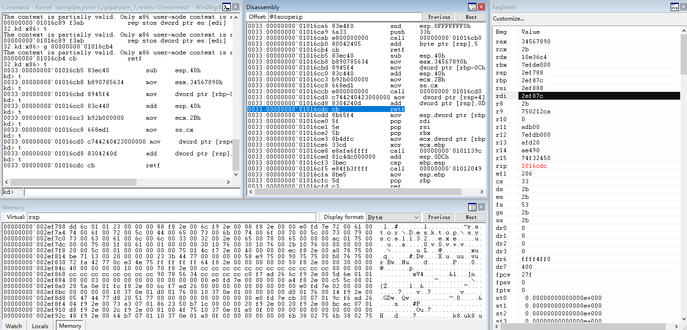

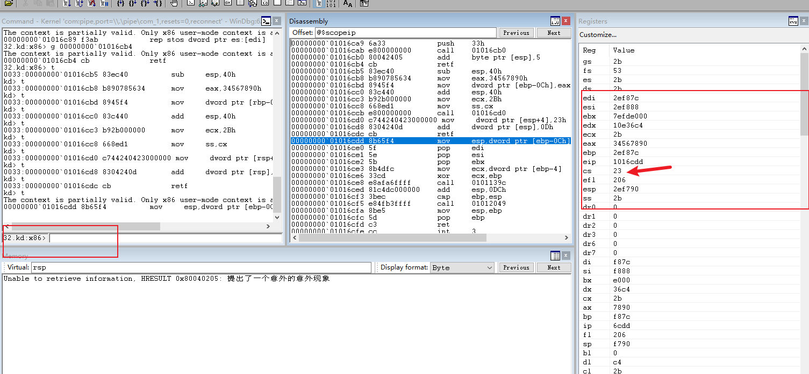


## 结果

ida32， 可以看到retf下面的x64指令被解析成了数据。

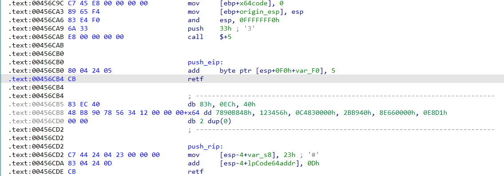

x64dbg 调试。

进入 64位模式

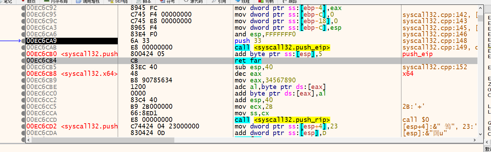

可以看到x64dbg 吧 64位汇编当成了32位汇编解析执行。  再往下执行的话会跳异常了。

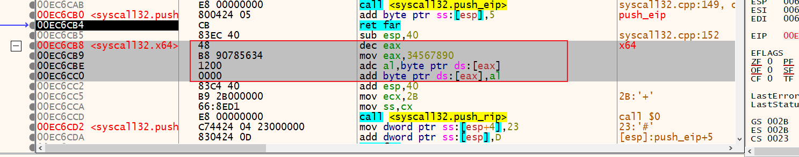


这种情况就只能上windbg调试。 或者复制一份exe 改pe标志让exe变成64位的，然后开两个ida，一个32位ida，一个64位ida 混合着看。

## 踩坑记录，缺点

这个只能运行简单的汇编代码， 不能运行shellcode， 经过很多轮的测试， 发现执行到shellcode的getprocaddress 这个位置 会出现c05异常。 

由于ntdll的导出函数太多了，没法办单步跟下去，所以暂时没有好的方法能够嵌入64位shellcode执行。不过可以用这个执行一些算法用来加解密shellcode。

## 踩坑答案

找了好几天的博客，外网大佬在博客中提到， 32位的pe程序在被系统加载时只加载了ntdll.dll 64位 ，其中shellcode开发关键的 kernel32.dll64位 和kernelbase.dll64位没有加载。

方法一： shellcode64 里面所有的系统api全部使用ntdll.dll64位里面的函数。

方法二： 在加载shellcode64 之前 补齐 kernel 和kernelbase 的基址。

## 总结：

到这了是不是感觉很熟悉。 没错这个就是天堂之门的实现原理。 废了半天劲造了一个重复的轮子出来。

暂时不想折腾了就不去补kerenl和kernelbase的基址了， 用在正规的签名文件中，函数一个用32位一个用64位在加点混淆代码，的确很折磨。


